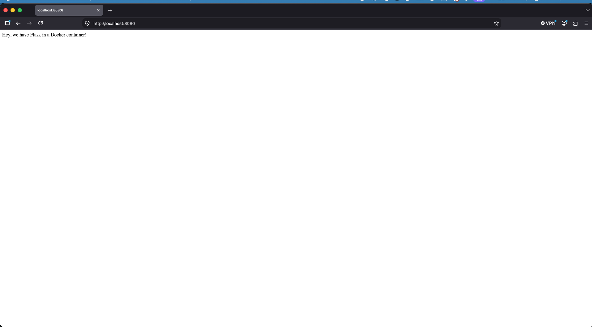

# Dockerized Flask App (Python 2.7)

A minimal Flask web app running in a Docker container, adapted from the Runnable.com tutorial. I fixed syntax errors in `app.py` and a typo in the `Dockerfile`, and pinned dependency versions in `requirements.txt` so the build works with Python 2.7.

